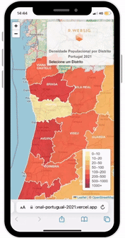

<h1 align="center">
  
   <a href="#"> R.WEBSIG </a>
</h1>

<h3 align="center">
     Platform to visualize population density - Portugual 2021.
</h3>

<h4 align="center"> 
	 Status: Finished
</h4>

<p align="center">
 <a href="#about">About</a> •
 <a href="#layout">Layout</a> • 
 <a href="#how-was-build">How was build</a> • 
 <a href="#pre-requisites">Pre-requisites</a> • 
 <a href="#tech-stack">Tech Stack</a> • 
 <a href="#how-to-contribute">How to contribute</a> • 
 <a href="#author">Author</a>
</p>


## About

Bringing geographical information to all because knowledge should be free.

---


## Layout

<div align="center">
  
  
</div>

---

## How was build

Based on data obtained from the 2021 Censo, a GeoJSON was created having as variables the name of the district, respective population density, county number and geographical points to demarcate the multipolygon.


---

## Pre-requisites

Before you begin, you will need to have the following tools installed on your machine:
[Git](https://git-scm.com), [Node.js](https://nodejs.org/en/) and [VSCode](https://code.visualstudio.com/)

### Running the Project

1. Fork the project.
2. Install the Live Server extension on Visual Studio Code.

``` jsx
// OR click in the link 
```
https://densidade-populacional-portugual-2021.vercel.app/

---

## Tech Stack

The following languages were used in the construction of the project:

**Frontend**  ([React](https://reactjs.org/))

-   **[HTML]**
-   **[CSS]**
-   **[JavaScript]**

---


## How to contribute

1. Fork the project.
2. Create a new branch with your changes: `git checkout -b feat/myFeatureName`
3. For each feature implemented, make a commit specifying what was done
4. Submit your changes: `git push -u origin feat/myFeatureName`

---

## Author

Developed by Rafaela C. Mirabile.
